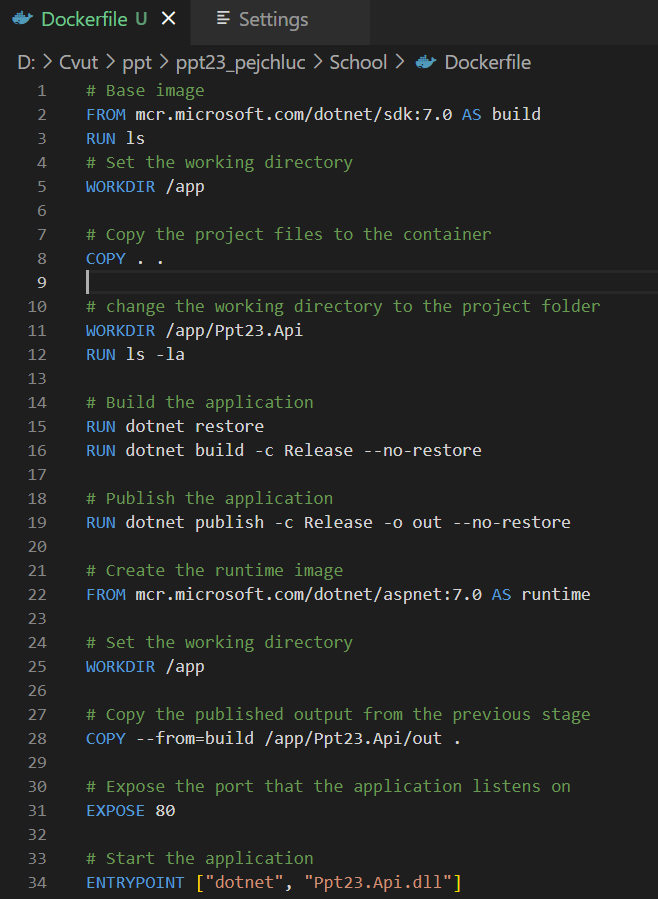
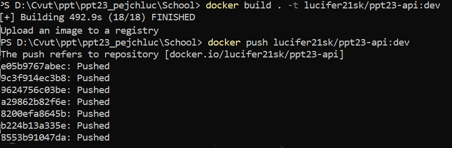
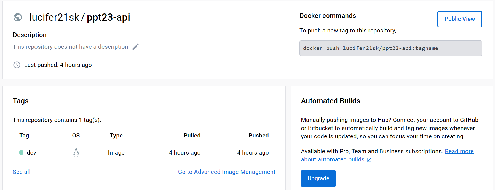
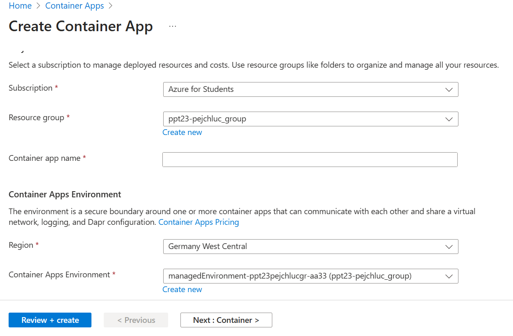
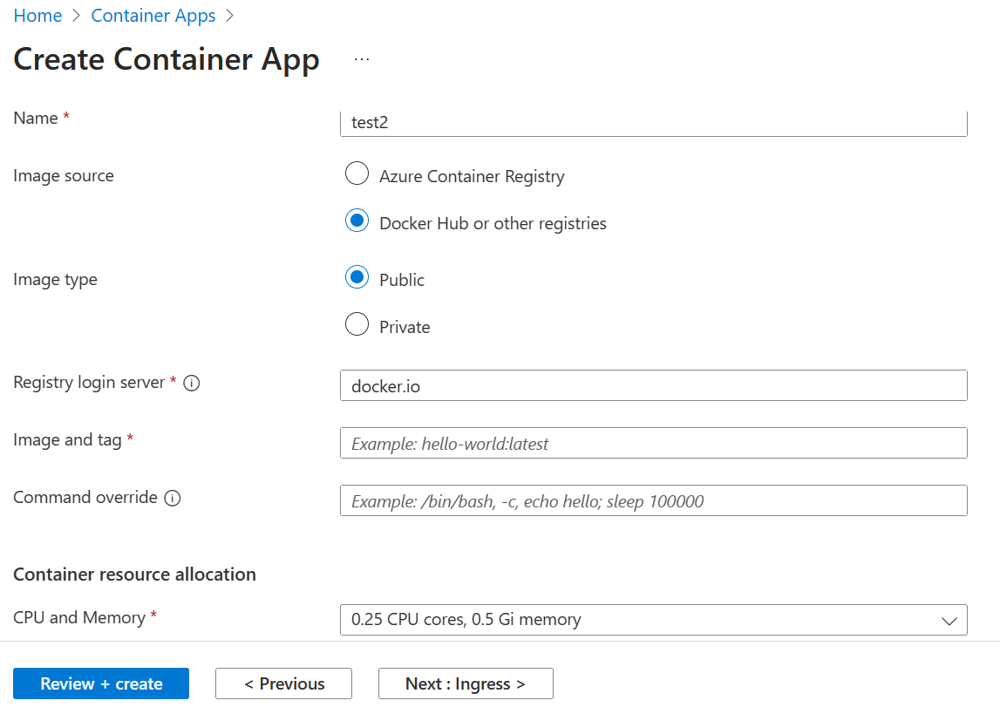
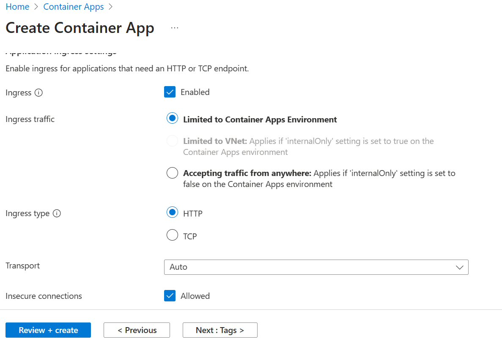
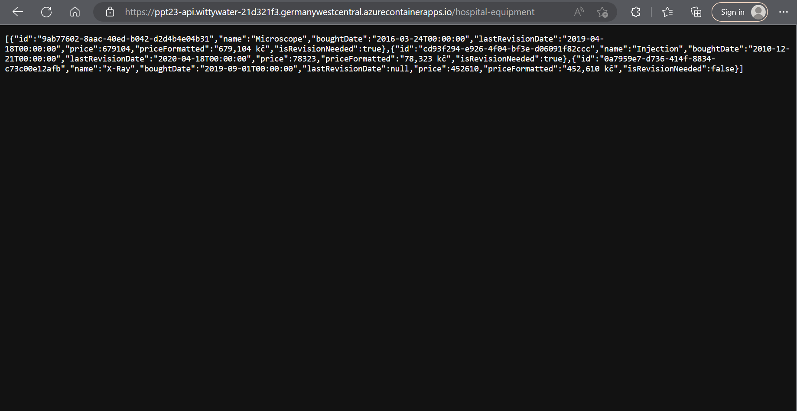

Container App vs App Service
---------------------------
Container App
- The container app is a container that runs on a host machine. The container app can be a Windows container or a Linux container.
- The container app can be deployed to a container host such as a Windows Server 2016 VM or a Linux VM.
- It provides a flexible platform that supports a variety of container technologies such as Docker, Kubernetes, and Mesos.

Benefits of Container App
- Easy Deployment: Container App makes it easy to deploy your application code with its support for multiple container technologies.
- Automatic Scaling: With the Container App Service, you can automatically scale your application up or down based on demand, ensuring your app is always running optimally.
- High Availability: Container App Service provides high availability for your application by automatically restarting your application if it crashes or becomes unresponsive.
- Security: Container App Service provides security for your application by isolating it from other applications running on the same host machine.

Disadvantages of Container App
Complexity: While Container App provides a flexible platform for containerized applications, it can be more complex to set up and manage than other Azure services.

App Service
- App Service is a platform as a service (PaaS) offering that enables you to quickly build, deploy, and scale enterprise-grade web applications on Windows or Linux using .NET, Java, Node.js, PHP, Python, or Ruby, as well as Docker containers.
- App Service is a fully managed service that handles infrastructure maintenance, load balancing, and scaling for you.

Benefits of App Service
- Easy Deployment: App Service makes it easy to deploy your application code with its support for multiple programming languages and frameworks.
- Automatic Scaling: With App Service, you can automatically scale your application up or down based on demand, ensuring your app is always running optimally.

Disadvantages of App Service
- Limited Flexibility: App Service provides a limited set of programming languages and frameworks, which may not be suitable for all applications.
- Limited Control: App Service provides limited control over the underlying infrastructure, which may not be suitable for all applications.
- Higher Cost: App Service can be more expensive than other Azure services, especially for high-traffic applications.

Differences
- Container App is a container that runs on a host machine, while App Service is a platform as a service (PaaS).
- Container App provides a flexible platform that supports a variety of container technologies such as Docker, Kubernetes, and Mesos, while App Service provides a limited set of programming languages and frameworks.
- Container App Service may be more complex to set up and manage than App Service, while App Service may have more limited customization options than Container App Service.

---------------------------

First need to create Dockerfile. Dockerfile is a text file that contains instructions for Docker to build an image.

Then we need to build an image from the Dockerfile. I did it using commands.
Then create repository on Docker Hub. I did it using commands. Now that i have a Dockerfile and a repository on Docker Hub, i can build an image and push it to the repository.

Now I can create a container from the image. I did it on Azure Portal.

Here it doesn't matter what region you choose. Just give it a name you want.

Here now we dont want the basic image but the one we created. So we will choose a image source as Docker Hub and give the image name and tag as the one we created. So for me it was lucifer21sk/ppt23-api:dev

Next we need to check that we are using HTTP endpoint.

We choose a port which we have in the Dockerfile. So for me it was 80. Then now we just create it and wait.
After it is succesfull created we can see a link to the API. 

Here we can see that my endpoint is working and i can see the data from the database.

Experience:
It wasn't hard to do it. I had some problems with Dockerfile, because i never did something with Docker but i found a solution on the internet. I found some tutorials, and what i can say Container App i think is better for when i want to have frontend backend and everything in one place. App Service is better for when i want to have only backend or frontend, because it is easy to create on Azure Portal.

Here is link for my API: https://ppt23-api.wittywater-21d321f3.germanywestcentral.azurecontainerapps.io/

